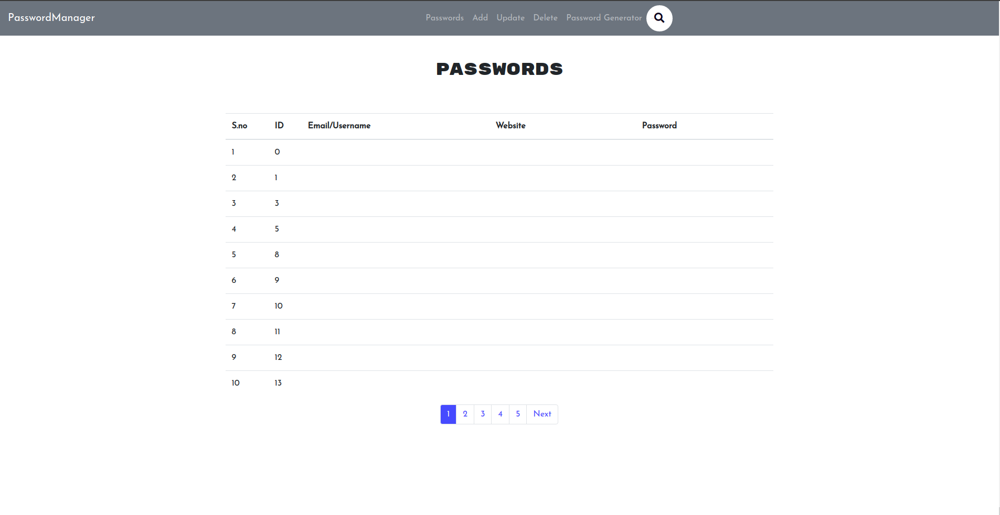
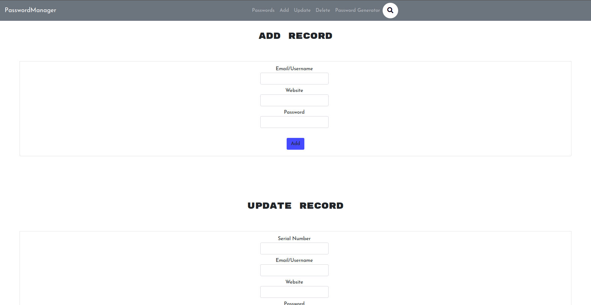
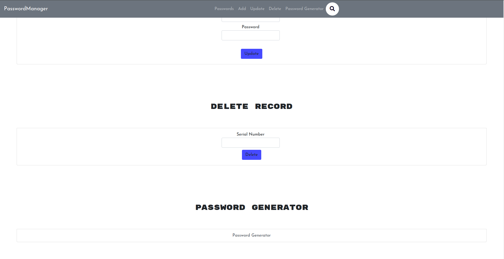

# PManager

## Introduction

PManager is a personal password manager. It is build with flask framework of python programming language.


<hr />



<hr />



<hr />




## Setup

1. Install the required libraries

   ```shell
   pip install -r requirements.txt
   ```

2. Initialise the database

   ```shell
   python initDB.py
   ```

3. Run the application

   ```shell
   python app.py
   ```


## Deploy

Use this article to deploy the application.

https://shashikantdwivedi.com/how-to-host-flask-website-using-apache-on-ubuntu-server-in-aws/